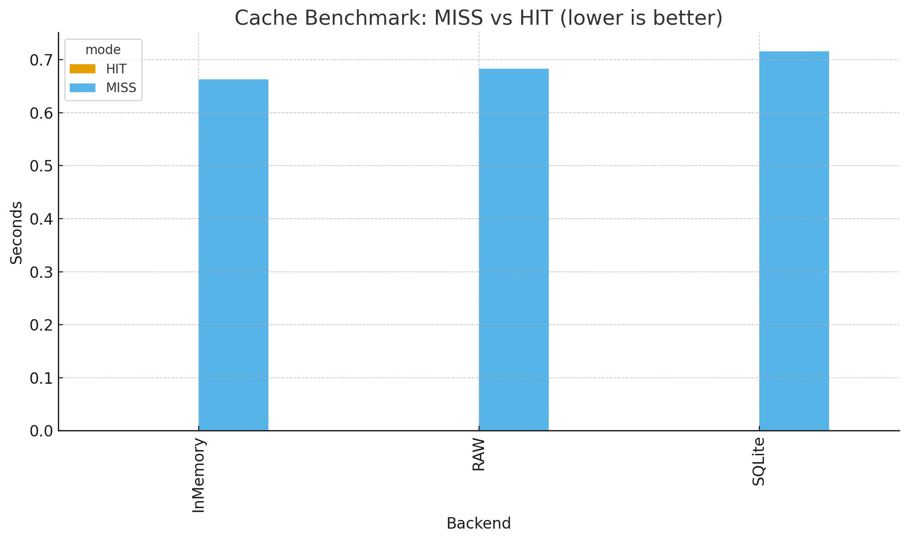

# PyCacheable — Benchmarks de Desempenho (MISS vs HIT)

> Comparação prática entre execução direta (sem cache), cache em memória (`InMemoryCache`)
> e cache persistente em disco (`SQLiteCache`).

---

## Metodologia

Os testes foram realizados com um workload **CPU-bound**, simulando um cenário de cálculo
intenso que se beneficia fortemente de caching.

### Cenário:
- Função utilizada: **Série de Nilakantha** para aproximação de π.  
- Iterações ajustadas automaticamente (`autotune_iter`) para gerar ~0.6 s de tempo de cálculo puro.  
- Cada backend testado com:
  - 1 chamada de *cache MISS* (primeiro acesso);
  - 7 chamadas de *cache HIT* (reuso da mesma chave);
- Resultados medidos via `time.perf_counter()` e agregados por mediana (para reduzir jitter).

---
## Cálculo usado (Série de Nilakantha)

A série converge rapidamente para π e é computacionalmente intensiva o suficiente
para simular workloads de processamento real:

```python
π = 3 + Σ [ 4 / ((2k)(2k+1)(2k+2)) * (-1)^(k+1) ]
```

---

## Resultados

| Backend   | Mode | Iterations | Seconds  | Calls |
|------------|------|-------------|-----------|--------|
| RAW        | MISS | 2 739 255 | 0.6827 | — |
| InMemory   | MISS | 2 739 255 | 0.6630 | 1 |
| InMemory   | HIT  | 2 739 255 | 0.000113 | 1 |
| SQLite     | MISS | 2 739 255 | 0.7157 | 1 |
| SQLite     | HIT  | 2 739 255 | 0.000098 | 1 |

---

## Interpretação

| Backend   | Speedup (HIT / MISS) | Observações |
|------------|----------------------|--------------|
| **InMemory** | **~5 870×** | HIT praticamente instantâneo; ideal para cache de execução local e jobs curtos. |
| **SQLite**   | **~7 300×** | Desempenho semelhante, com persistência entre execuções e processos. |

**Resumo:**  
O cache reduz o tempo de execução de ~0.68 s para ~0.0001 s — um **speedup superior a 5 000×**.  
A diferença entre `InMemory` e `SQLite` é marginal no HIT, mostrando que o overhead
de I/O é quase desprezível frente ao custo de cálculo original.

---

## Gráfico



---
## Reprodutibilidade

Para reproduzir os benchmarks localmente:

```bash
python benchmarks/bench_pi.py
```

O script:
1. Ajusta automaticamente o número de iterações (`autotune_iter`);
2. Executa o cálculo puro (RAW);
3. Executa os mesmos cálculos decorados com `@cacheable`:
   - uma vez (MISS),
   - várias vezes (HIT);
4. Exporta resultados `.csv` e `.png` para `benchmarks/`.

---