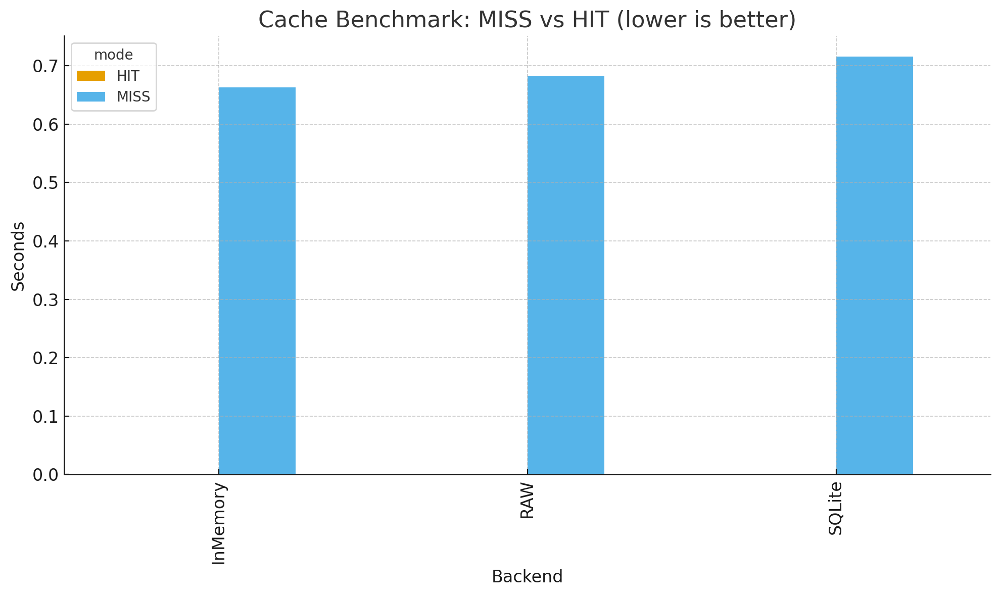

# PyCacheable — Performance Benchmarks (MISS vs HIT)

> Practical comparison between direct execution (no cache), in-memory cache (`InMemoryCache`)
> and persistent disk cache (`SQLiteCache`).

---

## Methodology

Tests were performed with a **CPU-bound** workload, simulating an intensive computation scenario
that strongly benefits from caching.

### Scenario:
- Function used: **Nilakantha series** for π approximation.  
- Iterations automatically adjusted (`autotune_iter`) to generate ~0.6 s of pure computation time.  
- Each backend tested with:
  - 1 *cache MISS* call (first access);
  - 7 *cache HIT* calls (same key reuse);
- Results measured via `time.perf_counter()` and aggregated by median (to reduce jitter).

---
## Calculation used (Nilakantha Series)

The series converges quickly to π and is computationally intensive enough
to simulate real-world processing workloads:

```python
π = 3 + Σ [ 4 / ((2k)(2k+1)(2k+2)) * (-1)^(k+1) ]
```

---

## Results

| Backend   | Mode | Iterations | Seconds  | Calls |
|------------|------|-------------|-----------|--------|
| RAW        | MISS | 2,739,255 | 0.6827 | — |
| InMemory   | MISS | 2,739,255 | 0.6630 | 1 |
| InMemory   | HIT  | 2,739,255 | 0.000113 | 1 |
| SQLite     | MISS | 2,739,255 | 0.7157 | 1 |
| SQLite     | HIT  | 2,739,255 | 0.000098 | 1 |

---

## Interpretation

| Backend   | Speedup (HIT / MISS) | Notes |
|------------|----------------------|--------------|
| **InMemory** | **~5,870×** | HIT nearly instant; ideal for local execution cache and short jobs. |
| **SQLite**   | **~7,300×** | Similar performance, with persistence between executions and processes. |

**Summary:**  
Cache reduces execution time from ~0.68 s to ~0.0001 s — a **speedup over 5,000×**.  
The difference between `InMemory` and `SQLite` is marginal on HIT, showing that I/O overhead
is almost negligible compared to original computation cost.

---

## Chart



---
## Reproducibility

To reproduce benchmarks locally:

```bash
python benchmarks/bench_pi.py
```

The script:
1. Automatically adjusts iteration count (`autotune_iter`);
2. Executes pure calculation (RAW);
3. Executes the same calculations decorated with `@cacheable`:
   - once (MISS),
   - multiple times (HIT);
4. Exports results to `.csv` and `.png` to `benchmarks/`.

---